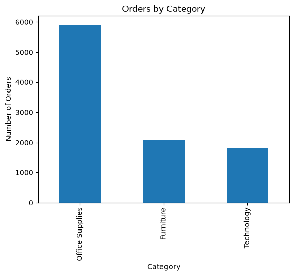
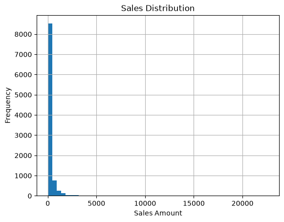

# Sales Data Analysis Pipeline

An end-to-end data analysis project that takes raw, messy sales data
and turns it into clean, verified business insights — using SQL,
Pandas, and NumPy together in one real pipeline.

**Dataset:** [Superstore Sales Dataset](https://www.kaggle.com/datasets/vivek468/superstore-dataset-final) (Kaggle) — 9,800 order line items across 4 years (2015-2018).

---

## What This Project Does

1. **Extract** — Load raw CSV data into a SQLite database
2. **Query** — Answer 10 business questions directly in SQL
3. **Clean** — Pull data into Pandas, fix missing values, standardize dates, remove duplicates
4. **Analyze** — Use NumPy to calculate revenue trends, growth rates, and statistics
5. **Report** — Export a summary CSV, a text report, and a formatted PDF

---

## Project Structure
```
sales-data-analysis-pipeline/
├── assets/ # Chart images used in this README
├── data/
│ ├── raw/ # Original CSV (not tracked — see Setup)
│ └── processed/ # Cleaned data + summary CSV
├── database/
│ └── sales.db # SQLite database
├── src/
│ ├── load_to_sql.py # CSV → SQLite
│ ├── queries.sql # 10 SQL business questions
│ ├── clean_data.py # Pandas cleaning
│ ├── analyze.py # NumPy analysis
│ └── generate_report.py # CSV + text + PDF report generation
├── reports/
│ └── sales_report.pdf # Final formatted report
├── notebooks/
│ └── exploration.ipynb # Exploratory data analysis
└── README.md
```

---

## Setup

**1. Clone the repo:**
```bash
git clone https://github.com/ProNomanRizvi/sales-data-analysis-pipeline.git
cd sales-data-analysis-pipeline
```

**2. Install dependencies:**
```bash
pip install -r requirements.txt
```

**3. Get the dataset:**
- Download the Superstore Sales Dataset from Kaggle
- Save it as `data/raw/superstore_sales.csv`

**4. Run the pipeline:**
```bash
python3 src/load_to_sql.py
sqlite3 -header -column database/sales.db < src/queries.sql
python3 src/clean_data.py
python3 src/generate_report.py
```

Final outputs land in `data/processed/summary_report.csv` and `reports/sales_report.pdf`.

---

## Data Distribution



Office Supplies has the highest order count, though Technology
generates more total revenue per sale.



The right-skewed distribution confirms most sales are small, with a
few high-value outliers pulling the mean above the median — a pattern
also seen in the business analysis below (Question 5).

---

## Business Questions & Analysis

### 1. Which product category drives the most revenue?

**Technology** generates the highest revenue ($827,456), followed by
Furniture ($728,659) and Office Supplies ($705,422) — despite Office
Supplies having by far the most individual orders (see the chart
above). This means Technology sells in lower volume but at a much
higher price point per sale, while Office Supplies relies on high
order frequency rather than big-ticket items.

### 2. Which regions perform best, and is high revenue the same as high value-per-sale?

**West** leads in total revenue ($710,220), but **South** actually has
the highest average sale value ($243.52) despite generating the least
total revenue ($389,151) of all four regions. This shows West's lead
comes from a higher volume of transactions, not larger individual
sales — a distinction that would be missed by only looking at total
revenue.

### 3. Is the business growing consistently, or is revenue seasonal?

Monthly revenue is highly volatile — growth rates swing from -75% to
+195% month-to-month, with no steady trend. However, a clear pattern
emerges every year: **November and December consistently post the
highest revenue** of each year (e.g., Nov 2018: $117,938 — the single
highest month across the whole dataset). This points to strong
seasonal, holiday-driven demand rather than steady organic growth.

### 4. Are premium shipping customers spending more per order?

Surprisingly, **no**. Average sale value across shipping modes is
nearly flat: Second Class ($236.55), Same Day ($232.75), First Class
($230.23), and Standard Class ($228.85) are all within about $8 of
each other. Customers don't appear to pay more per item when they
choose faster shipping — shipping speed and order value are
essentially unrelated in this dataset.

### 5. Does a small number of customers or products account for a large share of revenue?

Yes, on both fronts. The top single product (**Canon imageCLASS 2200
Advanced Copier**) alone generated $61,600 in revenue — more than
double the next highest product. Similarly, the top customer (**Sean
Miller**) spent $25,043, nearly 32% more than the 10th highest spender.
Combined with a sales distribution where the mean ($230.77) is over
4x the median ($54.49), this confirms revenue is concentrated in a
relatively small number of high-value transactions rather than spread
evenly across all sales.

---

## Key Technical Decisions

- **Missing `Postal Code` values** were filled with `0` rather than
  dropped, to preserve all 9,800 rows for revenue analysis (postal
  code wasn't used in any revenue calculation, so this had no impact
  on the findings above).
- **`Order ID` vs row count** — the dataset has 9,800 rows but only
  4,922 unique orders, because a single order can contain multiple
  line items (different products). All "total orders" metrics use
  the unique `Order ID` count, not row count, to avoid overstating
  order volume.
- **Dates required two different format strings** — the raw CSV uses
  `DD/MM/YYYY`, but once Pandas saves a cleaned CSV, dates round-trip
  back as `YYYY-MM-DD`. Each script that reads dates specifies the
  correct format explicitly rather than relying on auto-detection.

---

## Tech Stack

- **SQLite** — data storage and SQL querying
- **Pandas** — data cleaning and transformation
- **NumPy** — numerical analysis (growth rates, statistics)
- **ReportLab** — PDF report generation
- **Matplotlib** — exploratory visualizations

---

## Author

**Noman Rizvi** — part of a self-directed [ML Engineer learning journey](https://github.com/ProNomanRizvi/ml-engineer-journey).